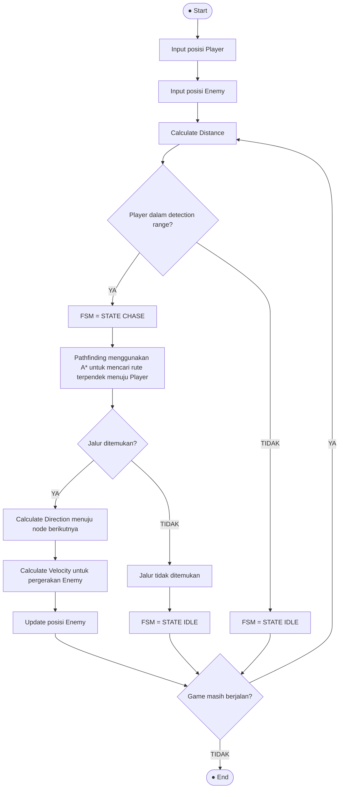

# Tugas 1 - Dungeon Enemy Pathfinding

> Implementasi deteksi dan pergerakan Enemy menuju Player menggunakan Finite State Machine (FSM), Algoritma A* (A-Star), dan Steering Behaviour.

---

## 1. Identifikasi Algoritma

### 1.1 Calculate Distance (Euclidean Distance)
* **Deskripsi**: Digunakan untuk menghitung jarak garis lurus antara posisi Enemy dan Player secara deterministik.
* **Rumus**:
  $$\text{Distance} = \sqrt{(x_2 - x_1)^2 + (y_2 - y_1)^2}$$
* **Code Snippet (Python)**:
  ```python
  def calculate_distance(enemy, player):
      return math.sqrt(
          (player[0] - enemy[0]) ** 2 +
          (player[1] - enemy[1]) ** 2
      )
  ```

---

### 1.2 Finite State Machine (FSM)
* **Deskripsi**: Mengatur status/state dan transisi perilaku Enemy berdasarkan jangkauan deteksi (`detection_range`):
  - **`STATE IDLE`**: Enemy diam di tempat saat jarak Player di luar jangkauan deteksi.
  - **`STATE CHASE`**: Enemy beralih mengejar Player saat jarak Player $\le$ `detection_range`.
* **Code Snippet (Python)**:
  ```python
  def get_state(enemy, player):
      distance = calculate_distance(enemy, player)
      if distance <= detection_range:
          return "CHASE"
      return "IDLE"
  ```

---

### 1.3 Pathfinding & Algoritma A* (A-Star)
* **Deskripsi**: Menentukan rute jalan terpendek dari Enemy ke Player di dalam map/dungeon dengan menghindari rintangan (obstacle). Menggunakan fungsi evaluasi:
  $$f(n) = g(n) + h(n)$$
  - $g(n)$: Biaya langkah aktual dari start ke node $n$.
  - $h(n)$: Heuristik Manhattan Distance dari node $n$ ke target Player.
* **Code Snippet (Python)**:
  ```python
  def heuristic(current, goal):
      return abs(current[0] - goal[0]) + abs(current[1] - goal[1])

  def get_neighbors(position):
      row, col = position
      directions = [(-1, 0), (1, 0), (0, -1), (0, 1)]
      neighbors = []
      for dr, dc in directions:
          new_row = row + dr
          new_col = col + dc
          if (0 <= new_row < len(dungeon) and 0 <= new_col < len(dungeon[0])
              and dungeon[new_row][new_col] == 0):
              neighbors.append((new_row, new_col))
      return neighbors

  def a_star(start, goal):
      open_set = [(0, start)]
      came_from = {}
      cost = {start: 0}

      while open_set:
          _, current = heapq.heappop(open_set)

          if current == goal:
              path = []
              while current != start:
                  path.append(current)
                  current = came_from[current]
              path.append(start)
              return path[::-1]

          for neighbor in get_neighbors(current):
              new_cost = cost[current] + 1
              if neighbor not in cost or new_cost < cost[neighbor]:
                  cost[neighbor] = new_cost
                  priority = new_cost + heuristic(neighbor, goal)
                  heapq.heappush(open_set, (priority, neighbor))
                  came_from[neighbor] = current

      return None
  ```

---

### 1.4 Steering Behaviour
* **Deskripsi**: Mengeksekusi pergerakan fisik langkah demi langkah menuju tiap node pada path A*:
  1. **Calculate Direction**: $\text{Direction} = \text{Target} - \text{Current}$
  2. **Calculate Velocity**: $\text{Velocity} = \text{Direction}$
  3. **Update Position**: $\text{Position}_{\text{baru}} = \text{Position}_{\text{lama}} + \text{Velocity}$
* **Code Snippet (Python)**:
  ```python
  def calculate_direction(current, target):
      return (target[0] - current[0], target[1] - current[1])

  def calculate_velocity(direction):
      return direction

  def update_position(position, velocity):
      return (position[0] + velocity[0], position[1] + velocity[1])
  ```

---

## 2. Flowchart Sistem



---

## 3. Cara Menjalankan Program

Jalankan script menggunakan Python di terminal:

```bash
python main.py
```
